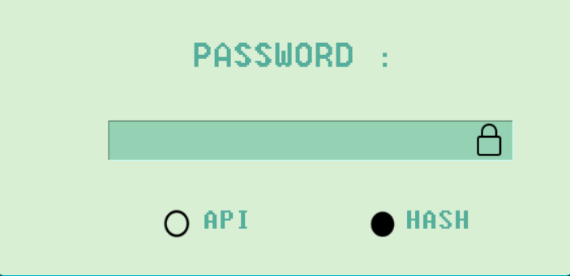
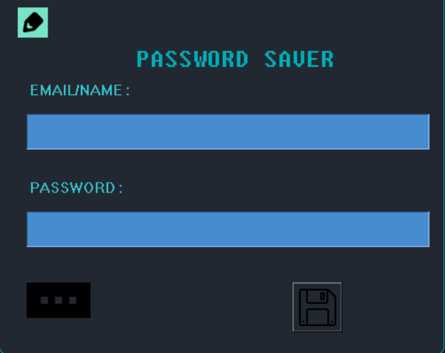
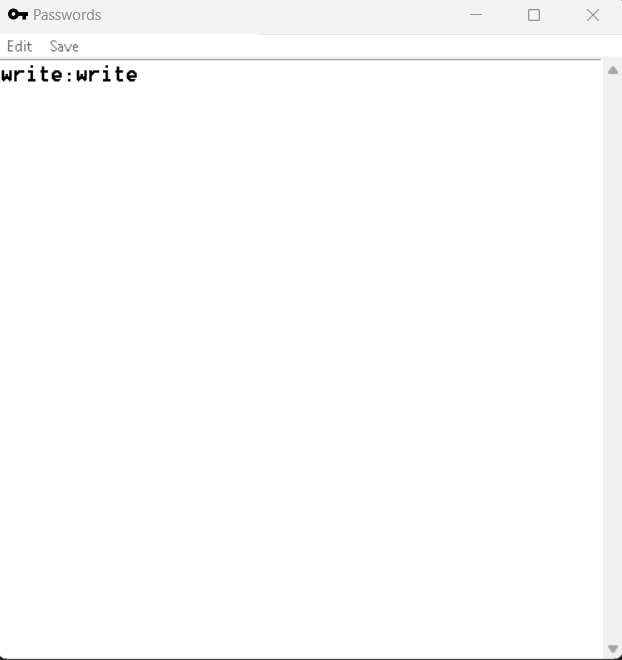
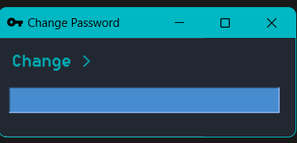

# Password Encryptor


## 📖 Description

A Password Key Saver , That saves Passes/Keys After Encrypting It.

## ✨ Features

- ## Password Panel
    
    * Insert A Password , To Enter Into Main Panel 
    * The Password is stored in encrypted and hashed form
    * **DEFAULT PASSWORD : 1 (hash)**
    
- ## Options
    
     - ### HASH 
     * In This Method,  You Need to Put Password to Enter
     - ### API
     * This Will Host A Site in [localhost:5000/generate](http://127.0.0.1:5000/generate)
     * From There You Need To Put Your Code In Box To Enter
     * Every Time There Will Randomized Text
- ## Main Panel
    
    - Write the Email , Password and Click the Black bar to Submit.    
    - It will ask your where to save your hashes, By Default It will be "encrypted.txt"
    - The Save Button is a sort of load button , where you can change your text path
    - ### Accessing Passwords
        * You Might Have Noticed Moving Cursor in 'PASSWORD SAVER' label changes its Colour
        * Clicking On It Makes another Screen Appear:
            
        * Converts Encrypted Data to Normal
        * #### EDIT
            - You can delete passwords 
            - Writing Anything Else Can create **ERROR**
            - You Can write Passwords by **{key}:{password}** format
        * #### 💾 SAVE
            - Save the text that you have written
    - ### Changing Password
        * Clicking on the "Pencil" icon in left hand cornor, Gives You Another GUI to change Password for Entrance GUI
        * **GUI**:
            
            
        * To Submit , Click On ``"Change"`` 
        ### ENJOY!

### 📦 Installation Steps

1. Clone the repository:
    ```bash
    git clone [https://github.com/Brainless-Guy/PasswordEncryptor.git](https://github.com/Brainless-Guy/PasswordEncryptor.git)
    ```
2. Navigate to the project directory:
    ```bash
    cd PasswordEncryptor
    ```
3. Install the dependencies:
    - 
        ```bash
        pip install -r requirements.txt
        ```
> [!NOTE]
> Opening this First time May Take Time As It will Install Requirments (If you didn't)

> [!IMPORTANT]
> Default Password : 1

## CONTRIBUTING
- **You are Allowed to make chages**
 - **Questions? issue**


### Prerequisites

Make sure you have Python installed. This project requires Python version 3.8 or higher for Smooth Running . You can check your Python version with:

```bash
python --version
```
